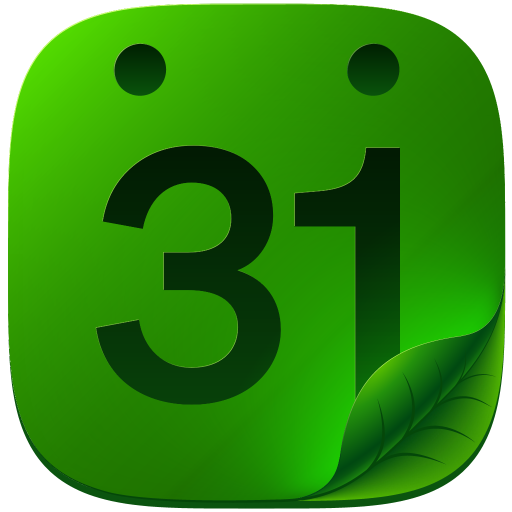
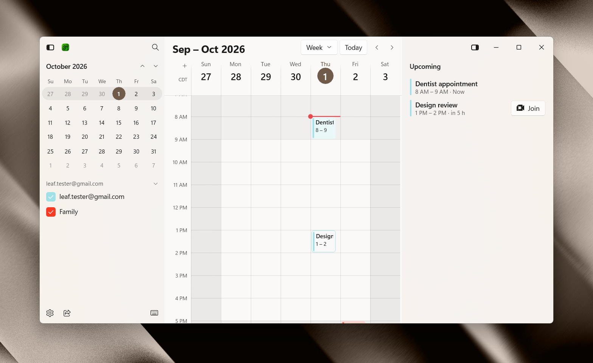

<p align="center">
    
</p>

<h1 style="text-align: center">Leaf Calendar</h1>

<p style="text-align: center">A fast, native Windows 11 app for your Google Calendar, with no server in between.</p>

<p align="center">
    
</p>

## Introduction

Leaf signs in with your own Google Cloud OAuth client and talks only to Google. Your calendar is cached on your PC, so Leaf opens fast and works offline, and edits made offline are sent once you're back online. There's no telemetry, analytics, or tracking. See [PRIVACY.md](PRIVACY.md) for what Leaf keeps and sends.

- Day, week, month, and 2 to 9 day views, with a mini month and your calendar list in the sidebar
- An event editor with guests, rooms, Google Meet links, and reminders
- A command menu (Ctrl+K) for searching events, jumping to dates, and running any action
- Other people's busy times overlaid on your calendar, and times to share
- A tray icon with an agenda flyout, plus reminder, "Join now", and invitation notifications
- Keyboard shortcuts for everything (press ? to see them)

### Prerequisites

- Windows 11 (x64)
- A Google account
- A Google Cloud project with an OAuth client of type **Desktop app**. Leaf walks you through creating one the first time it opens.

## Install

1. Download `LeafCalendar.cer` and the `.msix` from the [latest release](https://github.com/artistro08/leaf-calendar/releases/latest).
2. Trust the certificate. Run this once in an elevated PowerShell:

    ```powershell
    Import-Certificate -FilePath .\LeafCalendar.cer -CertStoreLocation Cert:\LocalMachine\TrustedPeople
    ```

3. Double-click the `.msix` to install it, or run:

    ```powershell
    Add-AppxPackage .\LeafCalendar_0.1.300.0_x64.msix
    ```

4. Open Leaf Calendar and follow the setup steps to connect your Google account.

That's it!

> The package is signed with the publisher's own certificate, so Windows only installs it once that certificate is trusted on your PC.

## Build From Source

You'll need the .NET 10 SDK (see `global.json`). From the repo root:

```bash
dotnet build LeafCalendar.slnx -c Debug
```

```bash
dotnet test --project tests/LeafCalendar.Tests/LeafCalendar.Tests.csproj -c Debug
```

`tools/` holds the PowerShell scripts for the signed Release (Native AOT) package and installing it.

## Documentation

- [Product spec](docs/superpowers/specs/2026-09-29-leaf-calendar-design.md)
- [Design standard](docs/design-standard.md)
- [Privacy](PRIVACY.md)
